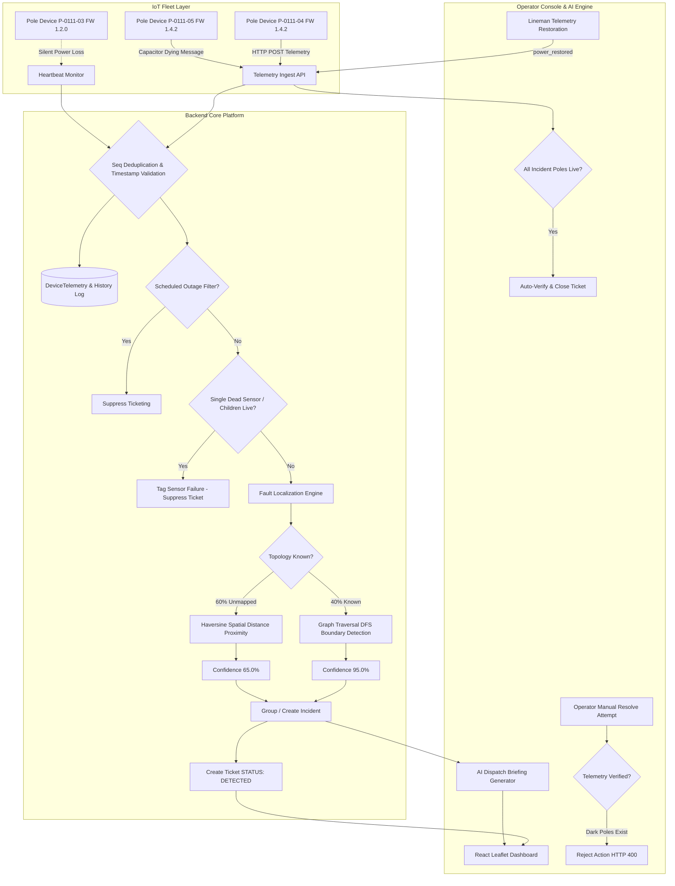

# System Architecture — KSPDB AI Power Fault Localization

This document describes the technical architecture, data ingestion engine, fault localization algorithm, noise handling mechanisms, domain model, REST API contracts, UI design philosophy, and AI feature integration for the **Karnataka State Power Distribution Board (KSPDB)** South Division fault localization platform.

---

## 1. System Overview & Data Flow



---

## 2. Ingestion & Data Sourcing

Telemetry is pushed by pole sensors via HTTP POST to `/api/v1/telemetry`.

### Volume & Scale
- **Subdivision Scale:** 4 Substations, 31 Feeders, 412 Distribution Transformers (DTs), 38,400 LT Poles, 34,900 IoT Devices.
- **Steady State:** ~39 messages/sec (15-min heartbeats).
- **Outage Burst:** Up to 5,000 messages in 10 seconds during major feeder trips.

### Ordering, Deduplication, and Skew
1. **Monotonic Sequence (`seq`):** Telemetry is deduplicated per device using `seq`. Out-of-order or duplicate packets (`seq <= last_seq`) are ignored. When a device reboots, `event = "boot"` resets sequence tracking.
2. **Capacitor Dying Messages & Firmware 1.2:** Firmware $\ge 1.3$ attempts a single `power_lost` packet from reserve capacitors (~70% delivery success rate). Firmware 1.2 (~8% fleet) simply stops heartbeating. The ingestion engine treats device silence beyond heartbeat windows as potential power loss.
3. **Dual Table Schema:**
   - `DeviceTelemetry`: Current state table (1 row per device) for $O(1)$ state lookups.
   - `TelemetryHistory`: Append-only audit log for replay, simulation, and verification.

---

## 3. Fault Localization Algorithm

The localization engine models the low-tension (LT) network as a directed radial tree graph $G = (V, E)$, where $V$ represents poles/DTs and $E$ represents physical wire spans.

```
Substation ➔ Feeder ➔ Transformer (DT) ➔ Pole 1 ➔ Pole 2 ➔ [BROKEN SPAN] ➔ Pole 3 ➔ Pole 4
                                                                             │
                                                                             └── Pole 3B (Branch)
```

### Hierarchy & Boundary Logic
1. **Feeder Fault:** If 100% of poles across all DTs under a feeder report de-energization $\Rightarrow$ Fault Type `FEEDER_FAULT`.
2. **Transformer Fault:** If 100% of poles under a DT are dark without upstream live poles $\Rightarrow$ Fault Type `TRANSFORMER_FAULT`.
3. **Span Fault:** Boundary between the last energized pole $P_{\text{live}}$ and first de-energized pole $P_{\text{dark}}$. Downstream impact is computed using Depth-First Search (DFS) traversal.

### The 60% Missing Topology Strategy
For ~60% of transformers where historical parent-child pole order is unmapped (`topologyKnown = false`):
1. The engine calculates spatial distance (Haversine formula) between the reported dark pole and all energized poles under the same transformer.
2. It infers the nearest energized pole as $P_{\text{live\_estimated}}$.
3. The system assigns **`confidence = 65.0%`** (versus **`95.0%`** for mapped lines) and includes an explicit warning in the operator reasoning and AI dispatch brief:
   > *"60% missing topology case: Geometrical proximity inferred span. Physical survey recommended."*

---

## 4. Noise Handling & False Positive Suppression

1. **Sensor Failure / Dead Modem Noise:** If pole $P_k$ reports `energized = false` but any downstream child pole $P_{k+1}$ reports `energized = true`, $P_k$ is flagged as `SENSOR_FAILURE`. No fault ticket is created.
2. **Scheduled Outage Suppression:** Before ticketing, the system checks `ScheduledOutageRepository`. If the feeder or DT is within an active load-shedding window (including +40 min overrun), ticketing is suppressed.

---

## 5. Ticket Workflow & Telemetry Verification

```
[DETECTED] ➔ [ACKNOWLEDGED] ➔ [CREW_ASSIGNED] ➔ [RESOLVED] ➔ [VERIFIED] ➔ [CLOSED]
```

- **Premature Resolution Protection:** If an operator attempts to manually click "Resolve" or "Close" while telemetry shows affected poles remain dark, the API rejects the request with **HTTP 400 Bad Request**:
  > *"Restoration unverified! Telemetry from field sensors indicates affected poles remain dark."*
- **Auto-Verification:** When power telemetry (`power_restored` / `boot`) is received for all affected poles, the system automatically transitions the ticket to `VERIFIED` and `CLOSED`.

---

## 6. REST API Design

All endpoints are versioned under `/api/v1`:

| Method | Endpoint | Description |
| font-mono | font-mono | |
| `POST` | `/api/v1/telemetry` | Ingest IoT pole telemetry |
| `GET` | `/api/v1/dashboard` | Control room metrics summary |
| `GET` | `/api/v1/poles` | Pole topology list for Leaflet map |
| `GET` | `/api/v1/tickets` | Operator ticket list |
| `PUT` | `/api/v1/tickets/{id}/status` | Update ticket workflow state |
| `GET` | `/api/v1/incidents/{id}/ai-brief` | AI Lineman Dispatch Briefing |
| `POST` | `/api/v1/simulator/span/{poleCode}` | Inject span fault simulation |
| `POST` | `/api/v1/simulator/transformer/{code}` | Inject DT outage simulation |
| `POST` | `/api/v1/simulator/feeder/{code}` | Inject feeder outage simulation |
| `POST` | `/api/v1/simulator/device/{poleCode}` | Inject sensor failure noise |
| `POST` | `/api/v1/simulator/outage` | Register scheduled outage |
| `POST` | `/api/v1/simulator/repair/{poleCode}` | Simulate power restoration telemetry |
| `POST` | `/api/v1/simulator/reset` | Reset network state |

---

## 7. AI Feature Justification

- **Feature:** AI Lineman Dispatch Briefing & Operator Explanation Service.
- **Why Here:** Control room operators at 2 a.m. need actionable dispatch summaries, not raw JSON graph outputs. The AI service synthesizes graph boundaries, PIN codes, estimated household impact, required repair materials (e.g. 50m ACSR wire, 100A fuses), and safety directives into a clean dispatch brief.
- **Why NOT for Localization:** Fault localization is a deterministic graph traversal problem. Graph algorithms execute in $< 2\text{ ms}$, cost $\$0$, and are 100% explainable, whereas LLMs are non-deterministic, slow, and prone to hallucinations on physical graph structures.
